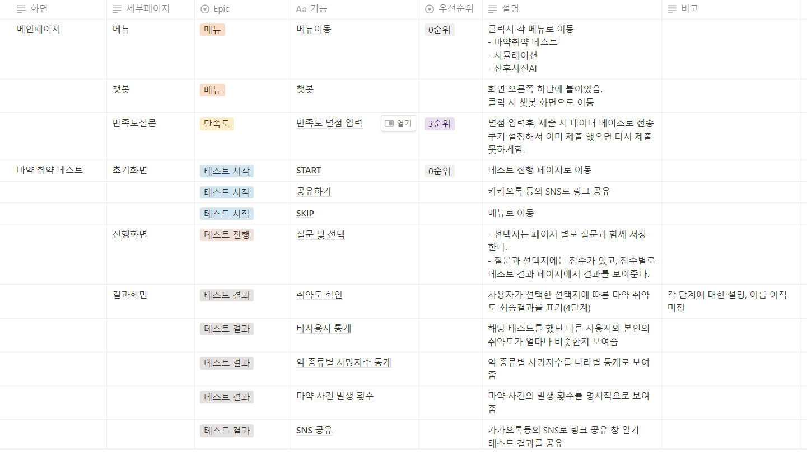

## DAY1
주제 방향성 잡기 및 아이디어 구체화  
### 사용자 : 마약 취약 계층, 관심이 있는 사람

### 카테고리

- 메인화면
    - (고민중)
- 체험
    - 얼굴인식 AR(벌레 기어가는거, 손 얼굴 이상해지는거)
    - 마약 후 내얼굴 미리보기(AI)
    - 양형체험 포맷

  [국민 양형체험 프로그램](https://www.scourt.go.kr/sc/exp/step.work?step_id=01&case_id=00)

- 정보 - 우선순위를 낮추자
    - 법률적 지식
    - 마약의 부작용
        - 신생아 금단 현상
        - 신체훼손 및 변형
        - 얼굴의 초췌함
        - 마약중독자의 강력사건
    - 마약 통계
        - 마약 종류별 사망자수
        - 지역별 사망자수
        - 경찰관서별 마약 발생건수
- 극복
    - 금단을 한지 몇일이 되었는지 기록해주기. (개인정보 없이)
    - 30일 몇명 1년 몇명
    - 재활 센터 정보(+챗봇)
    - 극복 후기(기존 마약퇴치본부의 후기, 영상인터뷰)
- 고려해볼 사항
    - 신고시 보상금 정책
    - 홈페이지 만족도 설문
    - 마약 유혹 스트레스 확인 https://smore.im/quiz/Kd4DM9muBu

---
### DAY2
### 요구사항 명세서 작성 및 와이어프레임 작성  

---
### DAY3
### 기능명세서 작성 및 회의
구체적인 흐름을 잡았지만 아직 모르는 사람이 볼 때 어떻게 보일지 생각을 못했다. 앞으로는 좀 더 사용자입장에서 생각해봐야겠다.

---
### DAY4
### 디자인 및 피그마
시뮬레이션을 적용할 디자인 레퍼런스 검색 및 피그마 작성  
오후에는 팀으로의 성장에 관련한 유튜브 라이브 시청 및 참여  

---
### DAY5
### 피그마 및 문서정리
어제 덜 완성한 시뮬레이션 피그마 진행  
오후에는 산출물 정리와 피드백을 바탕으로 앞으로의 방향 탐색  

---
### DAY6
### 아이디어 회의 및 피그마
🖋️*Keep* : 

- 적절한 역할 분배 및 수행
- 화목한 분위기

🖍️*Problem* : 

- 피그마가 끝나지 않는다…
- 재방문 할 아이디어가 뭐가 있을까…

💡*Try* : 

- 피그마 완성
- 아키텍쳐 설계

---
### DAY7
### 업무분담 및 erd 설계
🖋️*Keep* : 

- 업무분담으로 인해 효율성이 증가하였다.

🖍️*Problem* : 

- 슬슬 개발을 시작해야하는데 할 게 너무 많다.

💡*Try* : 

- erd 설계를 진행해서 피드백을 받아봐야겠다.
- AI도 어떤 라이브러리를 쓸 지 조사가 필요하다.

---
### DAY8
### erd 설계 및 아키텍처 설계
🖋️*Keep* : 역할을 분담해서 충실히 이행하였다.

🖍️*Problem* : 좀 더 상세한 일정관리가 필요할 것 같다.

💡*Try* : erd마무리 및 API 설계를 빨리 마무리해야겠다.

---
### DAY9
### erd 완성 및 API 설계
🖋️*Keep* : 

- 각자 주어진 일을 열심히 하면서도 서로 소통을 많이 해서 좋다.

🖍️*Problem* : 

- 프론트도 시작해서 백엔드도 빨리 시작해야할 것 같다.
- aws랑 연결하는게 무섭다…

💡*Try* : 

- 설계된 erd를 바탕으로 spring 프로젝트 기본구성을 시작해야겠다.

---
### DAY10
### 발표평가 및 db 테이블 생성
🖋️*Keep* : 

- 각자 맡은 역할 충실히 이행하는 모습이 좋아요

🖍️*Problem* : 

- 개발 속도가 느린것 같다…! 더 열심히 해야겠다

💡*Try* : 

- 주말까지 취약테스트 api 만들기
- db에 데이터도 넣기

---
### 08.08
오늘은 계속 colab에서 진행해서 대신 회고로 commit 해야겠다.
🖋️*Keep* : 오늘따라 다들 집중력이 남달랐던 것 같다! 얼마 안남았으니 더 집중해야겠다.

🖍️*Problem* : AI에 학습과 예측을 붙여놨는데 분리하니 에러가 나서 해결중이다.

💡*Try* : 예측만 분리해서 실행해보고 AR 도와주러 가야겠다.