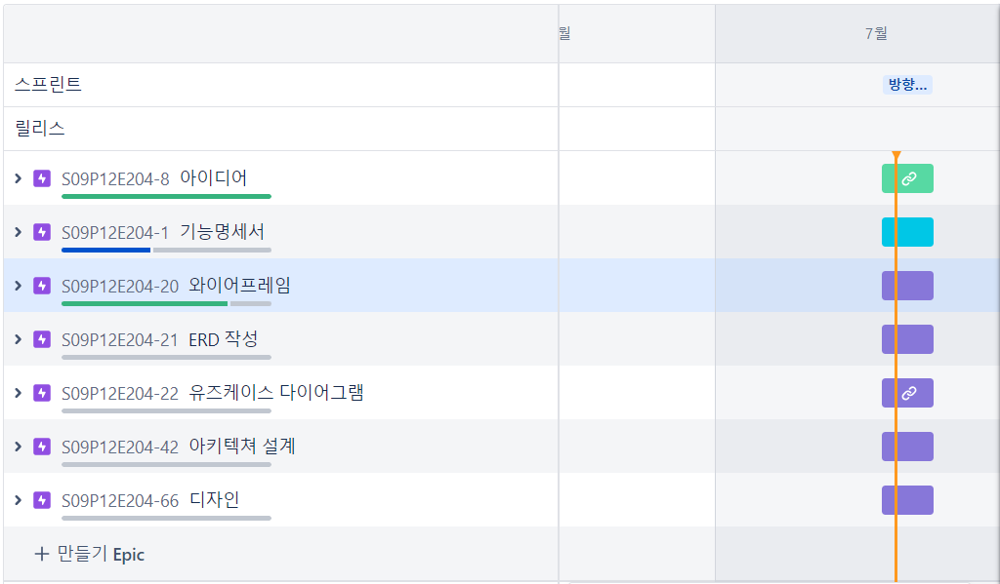
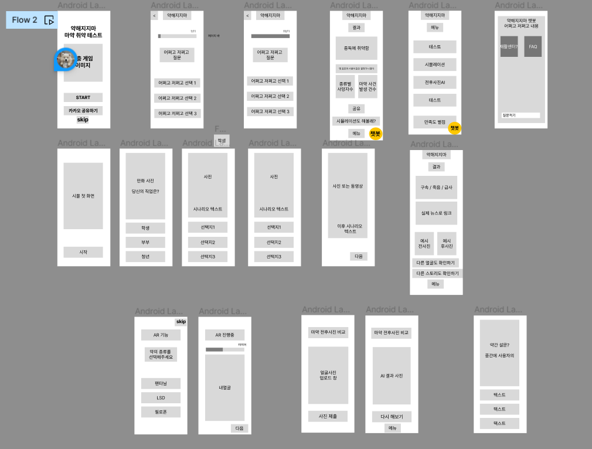

## 7월 17일

- 아이디어 회의를 구체화 했다.
- jira에 이슈를 구체화하고 스프린트를 작성했다.
- 아직 어렵지만, 일단 해보기로 했다.
- 요구 사항 정의서와 기능명세를 명확하게 정의 하면 어떻게 할지 나올것 같다.

## 7월 18일

- 오전에는 아이디에이션을 주로 했다.
- 아이디에션을 기반으로 사용자 요구사항을 정리했다.
- 오후에는 요구사항 정리한 것을 기반으로 와이어 프레임을 피그마를 통해 구상해보았다.
- 하나씩 산출물을 늘려나가니 막연했던 부분들이 조금씩 구체화 되었다.

## 7월 19일

회고

🖋️*Keep* : 편하게 의견을 주고 받을 수 있는 분위기가 좋다. 고집 부리지 않고 언제든 괜찮다면 받아들일 준비가 되어 있다.

🖍️*Problem* : 디자인 쪽 경험자가 없어서 조금 어려움을 겪고 있다. 어떻게 사용자에게 몰입감을 줄 수 있을지 더 고민 해봐야 한다.

💡*Try* : 지금과 같은 분위기를 유지할 수 있도록 노력하고, 디자인은 레퍼런스와 다른 앱들은 어떤 것들이 있는지 조금 더 찾아봐야겠다.

오늘 한 것
- 기능 명세서를 작성했다.
- 디자인을 시작했다.
- 디자인 하는 과정에서 사용자를 생각하게 되었고, 어떻게 몰입도를 높일지 더 고민이 필요함을 느꼈다.

기능 명세서
https://www.notion.so/b38d133166154382b5cc607c87198819?pvs=4

## 7월 20일

- 오전에는 디자인을 진행했다.
- 오후에는 시너지 창출을 위한 팀 워크십을 진행했다.

## 7월 21일

🖋️*Keep* : 쉬는 시간 가지기. 리프레쉬 시간이 있어서 생각의 전환이 가능했다. 산출물이 완벽하지 않더라도 빠르게 여러개의 결과를 보는게 상당히 도움이 되는 것 같다.

🖍️*Problem* : 우리가 기획한 내용이 생각보다 딥해서 공부가 많이 필요할 것 같다. 사용자 입장에서 더 생각 해야겠다.

💡*Try* : AI와 AR 그리고 ERD까지 학습이 필요하다.

## 7월 24일

🖋️*Keep* : 

- 화목한 분위기
- 각자 맡은 역할 충실히 수행하기

🖍️*Problem* : 

- 쉬는 시간이 안 지켜지고 있다.
- 아이디에이션이 힘들다.

💡*Try* : 

- 개인 학습을 해야 한다.
- 새로운 아이디어를 떠올리기 보다 개발에 집중해서 한명이 다른 사람에게도 소개 시켜줄 수 있도록 노력하겠습니다.

## 7월 25일

🖋️*Keep* : 

- 각자 업무분담을 하여 분업화를 진행했는데, 이 부분이 좋았다.

🖍️*Problem* : 

- 생각보다 더 시간이 많이 부족하다.

💡*Try* : 

- 기획도 중요하지만 진행을 위해서 기능을 먼저 기획하고, 컨텐츠는 개발이 어느정도 진행된 뒤에 다시 더 디벨롭 해야겠다.

## 7월 26일

🖋️*Keep* : 역할과 일정을 잘 나눠서 진행한 점이 좋았습니다.

🖍️*Problem* : 일정이 빠듯하다. 

💡*Try* : CICD 공부와 구현을 진행해야겠다.

## 7월 27일

🖋️*Keep* : 

- 자유롭게 소통하는 분위기가 좋다.

🖍️*Problem* : 

- 쉬는 시간이 잘 안 지켜지고 있다.

💡*Try* : 

- 쉬는 시간도 일하는 것처럼 잘 지켜보자.

## 7월 28일

🖋️*Keep* : 

- 잘한 발표는 아니었지만, 시도 했음에 의의를 두고 싶다.

🖍️*Problem* : 

- 진도가 너무 느리다… 하나 해결하면 바로 앞에서 또 하나가 에러가 나는중이다.

💡*Try* : 

- CICD 빨리빨리
