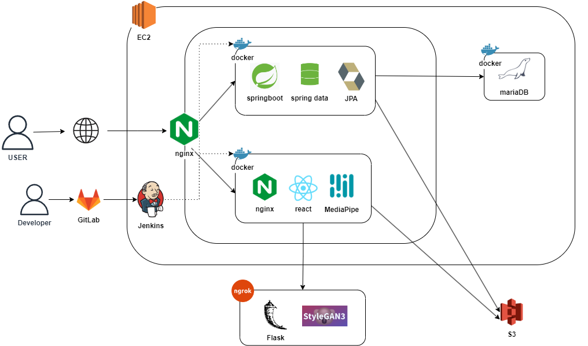
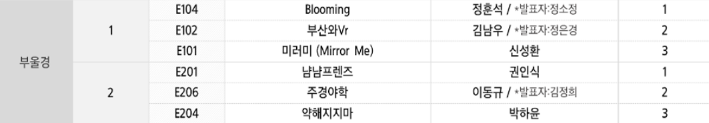
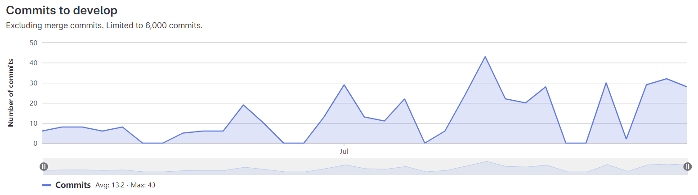
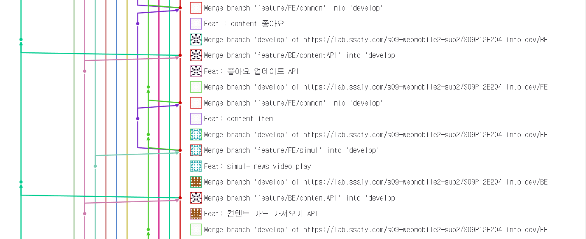

# README

| 개발 기간 | 2023.07.04 ~ 2023.08.18 (7주) |
| --- | --- |
| 개발 인원 | 6인 |
| 🏆 수상 | SSAFY 공통프로젝트 3위 |

개발환경

| 언어 | JAVA, JavaScript, HTML, CSS, python |
| --- | --- |
| 플랫폼 | FE: React , BE: Spring Boot |
| 서버 | AWS EC2 |
| DB | mariaDB |

[자세한 기술스택](https://stellar-sceptre-807.notion.site/642b3d9a38e647e3b05c21ba2a6da8b2?pvs=4)
---

# 기획의도

최근 ‘마약’이라는 단어가 일상생활에서 너무 남용되고 있습니다. 따라서 마약에 대한 정보를 제공함으로서 마약의 유해성을 깨닫게 하는 **체험형 마약 예방 플랫폼**을 개발하고자 하였습니다. 

이를 통해 마약을 접하기 전, 불쾌감을 느껴 마약에 대한 경각심을 느끼고 대한민국 사회에서 마약은! NO!가 당연하게 여겨졌으면 좋겠습니다.

사용자층 : **10대~30대**. 사회 현상에 관심있는 사람, 마약에 대한 정보가 궁금한 사람

초기에는 10대를 타겟팅 하려 하였지만, 현재 대한민국의 연령별 마약사범수 분포를 보면 20대~30대의 비율이 50%를 초과한다. 따라서 범위를 더 넓히게 되었습니다.

# 주요 기능

- (학생, 임산부, 청년 3가지 스토리의) 시뮬레이션
- 마약 취약성 테스트
- 마약전후 AI 사진 생성
- 컨텐츠 카드뉴스
- 챗봇

# 아키텍처 구조도



# 서비스 시연
[서비스 시연](https://stellar-sceptre-807.notion.site/39f93fb9b67140098c357de3f46f8679?pvs=4)

# 수상내역


[개발후기](https://stellar-sceptre-807.notion.site/4fa44563e6754deb9a323056f2be662f?pvs=4)

# 프로젝트 컨벤션

### Git





### Jira
[jira 번다운 차트](https://stellar-sceptre-807.notion.site/598514c70c1c4defbc0db9e59cf92183?pvs=4)

### 프론트엔드

```
Front-end/
  ├── public/
  │   ├── index.html
  │   └── favicon.ico
  ├── assets/
  ├── src/
  │   ├── api-config/
  │   ├── assets/
  │   │   ├── images/
  │   │   └── css/
  │   ├── components/
  │   │   ├── AI/
  │   │   │   ├── ResultForm/
  │   │   │   └── UploadForm/
  │   │   ├── App/
  │   │   ├── AR filter/
  │   │   ├── common/
  │   │   │   ├── BeforeAfterImg/
  │   │   │   ├── BottomMenu/
  │   │   │   ├── Loading/
  │   │   │   ├── Percentage/
  │   │   │   ├── Share/
  │   │   │   └── Statistic/
  │   │   ├── Content/
  │   │   ├── Home/
  │   │   │   ├── Content/
  │   │   │   ├── Footer/
  │   │   │   └── Info/
  │   │   ├── Nav/
  │   │   ├── SimulationForm/
  │   │   └── Test/
  │   ├── fonts/
  │   │   └── font.css
  │   ├── pages/
  │   │   ├── AI/
  │   │   ├── AR/
  │   │   ├── Chatting/
  │   │   ├── Content/
  │   │   ├── Homepage/
  │   │   ├── Loading/
  │   │   ├── NotFound/
  │   │   ├── SideMenu/
  │   │   ├── Simulation/
  │   │   └── Test/
  │   ├── index.js
  │   └── index.css
  ├── .env
  ├── .gitignore
  ├── Dockerfile
  ├── package.json
  └── README.md
```

### 백엔드

```
Back-end/
  ├── src/main/
  │   ├── java/com/ssafy/drug
  │   │   ├── config/
  │   │   ├── controller/
  │   │   ├── dto/
  │   │   ├── model/
  │   │   ├── repository/
  │   │   │   └── querydsl/
  │   │   ├── service/
  │   │   └── DrugApplication.java
  │   └── resources/
  │       └── application.yml
  ├── .gitignore
  ├── build.gradle
  ├── Dokerfile
  └── settings.gradle
```