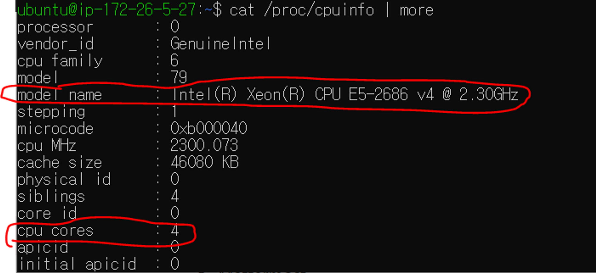
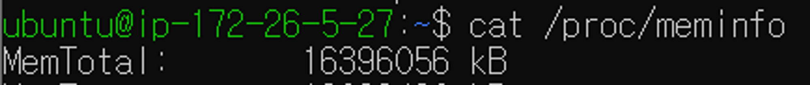
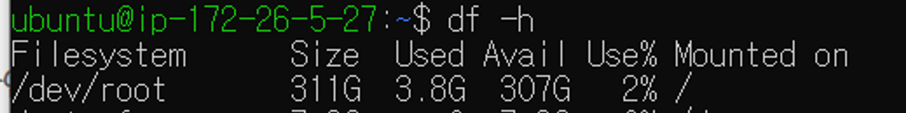
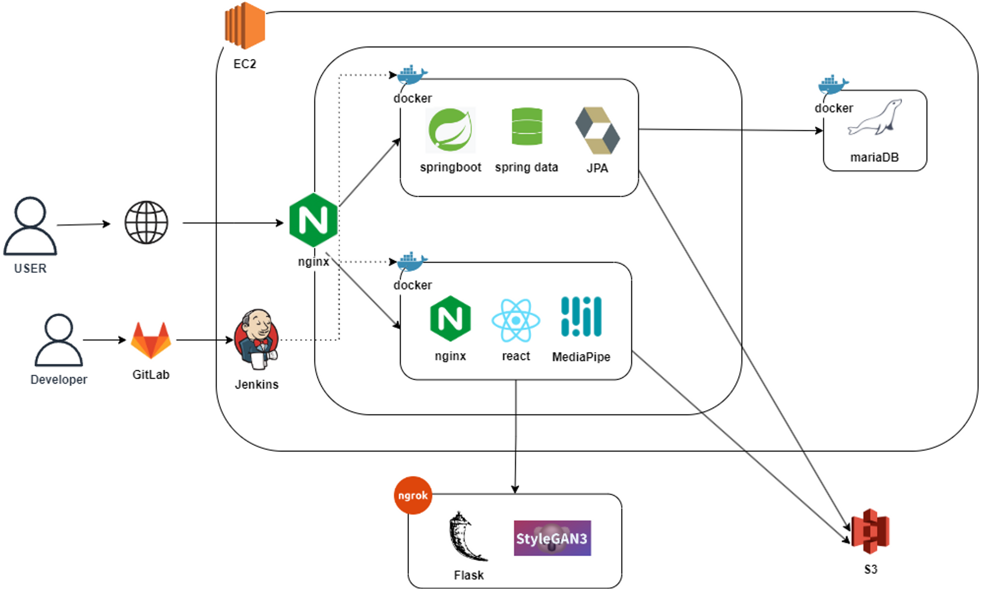
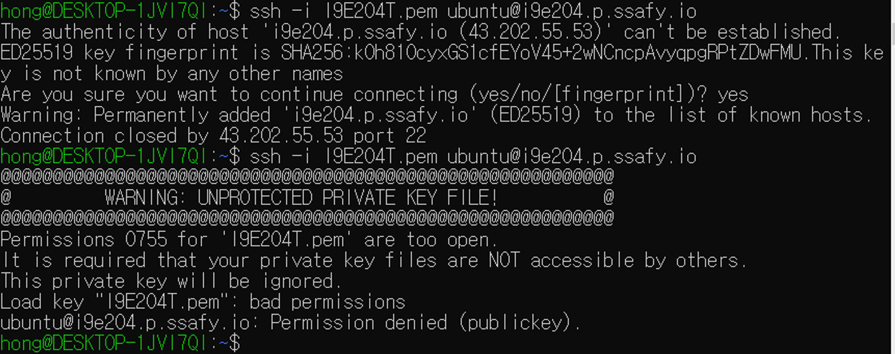
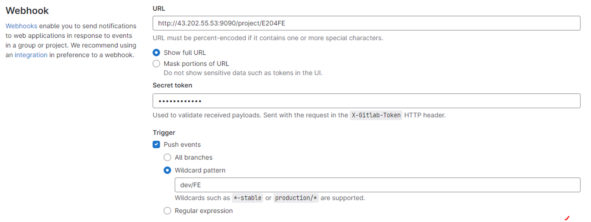
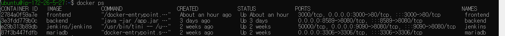

# 포팅메뉴얼

## 🛠️개발환경

---

## 서버 인스턴스 사양

- CPU 정보: Intel Xeon(R) Core 4개

    

- RAM : 16GB
    
    
    

- Disk : 300GB


    

## 형상 관리

- Gitlab
- Jira

## UI / UX

- Figma

## OS

- Ubuntu 20.04
- Windows 10

## 이슈 관리

- Jira

## Communication

- Mattermost
- Notion

## Front-end

- React : 18.2.0
- Axios : 1.4.0
- Node : 18.16.0
- @mediapipe/camera_utils : 0.3
- @mediapipe/drawing_util : 0.3
- @mediapipe/face_mesh : 0.4
- @react-spring/web : 9.7.3
- numeric : 1.2.6
- react-dom : 18.2.0
- react-draggable : 4.4.5
- react-router-dom : 6.14.2
- react-toastify : 9.1.3
- react-use-gesture 9.1.3
- react-webcam : 7.1.1

## DB

- MariaDB : 8.0.33

## Back-end

**Spring Boot**

- IntelliJ : 2023.1.3
- Java : 17.0.7
- Spring Boot : 3.1.2
- querydsl : 5.0.0 jakarta
- lombok
- spring-boot-starter-data-jpa
- spring-boot-starter-web

**Flask**

- Python : 3.10.12
- Google Colab
- Flask : 2.2.5
- ngrok : 4.1.1

## IDE

- IntelliJ : 2022.3.1
- Visual Studio Code : 1.75.0

## Infra

- Web Server : Nginx
- Jenkins : 2.416
- Docker : 24.0.5

### 기타 편의 툴

- WSL2
- Postman

# 시스템 아키텍처



# 배포 과정

## 📂빌드 및 배포

---

## SSAFY EC2(서버) 접속

- 윈도우 기본 앱인 wsl 이용
- 바탕화면에 있던 팸키를 우분투 폴더로 복사 붙여넣기
    - cp /mnt/c/Users/SSAFY/Desktop/I9E204T.pem ~/
- ssh 접속
    - cd ~
    - ssh -i I9E204T.pem [ubuntu@i9e204.p.ssafy.io](mailto:ubuntu@i9e204.p.ssafy.io)
    - ssh 접속 쉽게 하는법
        
        ```jsx
        mkdir ~/.ssh 
        cd ~/.ssh // ssh 폴더 생성 및 이동
        cp [로컬 pem 키 위치] ~/.ssh // pem 키 옮기기
        vi config  // config 파일 생성
        ```
        
    - config
        
        ```jsx
        Host ssafy
        HostName [i9e204.p.ssafy.io](mailto:ubuntu@i9e204.p.ssafy.io)
        User ubuntu
        IdentityFile ~/.ssh/I9E204T.pem
        ```
        
    - 이후부터 ssh ssafy로 접속

- 오류 해결
    
    
    
    - 권한 에러
    - 개인키는 권한이 너무 open 되어있어도 경고 문구가 뜨면서 permission deny가 뜨기 때문에 권한을 축소시켜서 (chmod 400) 사용하도록 한다.

- 방화벽 포트 확인 : sudo ufw status verbose

## EC2 초기 설정

```sql
$ sudo apt update
$ sudo apt upgrade
$ sudo apt install build-essential

$ sudo ln -sf /usr/share/zoneinfo/Asia/Seoul /etc/localtime # 한국으로 시간 설정
```

## 서버에 도커 설치

```jsx
$ sudo apt update
$ sudo apt install apt-transport-https ca-certificates curl software-properties-common
$ sudo wget -qO- https://get.docker.com/ | sh
```

## MariaDB 설치

```jsx
$ docker pull mariadb
```

```jsx
# main
$ docker run --name mariadb -d -p 3306:3306 -v /var/lib/mysql_main:/var/lib/mysql --restart=always -e MYSQL_ROOT_PASSWORD=root mariadb

# dev
$ docker run --name mariadb -d -p 3307:3306 -v /var/lib/mysql_dev:/var/lib/mysql --restart=always -e MYSQL_ROOT_PASSWORD=root mariadb
```

마리아 디비 비번 : 1793

```jsx
docker exec -it mariadb /bin/bash

mysql -u root -p
```

오류

- bash: mysql: command not found
    - apt-get install mysql-client -y

```jsx
create user 'ssafyE204'@'%' identified by 'ssafyE204';

grant all privileges on *.* to 'ssafyE204'@'%';
flush privileges;
```

- curl [ifconfig.me](http://ifconfig.me/) ← 퍼블릭 ip주소 알아내기
- 파일 전송 : `scp -i [pem file] [upload file] [user id]@[ec2 public IP]:~/[transfer address]`

## 젠킨스 설치

```sql
docker run -d -p 9090:8080 --name=jenkins \
-e TZ=Asia/Seoul
-v /var/jenkinsDir:/var/jenkins_home \
-v /var/run/docker.sock:/var/run/docker.sock \
jenkins/jenkins

# 초기 비밀번호
$ docker exec -it cfb /bin/bash
$ cat /var/jenkins_home/secrets/initialAdminPassword
```

- 퍼블릭 ip주소:9090으로 접속

### [Nginx]

```jsx
server {
        listen 80;
        server_name urnotweak.site;
        return 301 https://urnotweak.site$request_uri;
}

server {
        listen 443 ssl;
        ssl on;
        server_name urnotweak.site;

        ssl_certificate /etc/nginx/ssl/certificate.crt;
        ssl_certificate_key /etc/nginx/ssl/private.key;

        location / {
                proxy_pass http://localhost:3000;
        }

        location /api {
                proxy_pass https://localhost:8589;
        }

}
```

### [Front End]

```jsx
// nginx.conf
server {
    listen 80;
    
    location / {
        root    /app/build;
        index   index.html;
        try_files $uri $uri/ /index.html;
    }
}
```

```jsx
// Dockerfile

# nginx 이미지를 사용합니다. 뒤에 tag가 없으면 latest 를 사용.
FROM nginx

# root 에 app 폴더를 생성
RUN mkdir /app

# work dir 고정
WORKDIR /app

# work dir 에 build 폴더 생성 /app/build
RUN mkdir ./build

# host pc의 현재경로의 build 폴더를 workdir 의 build 폴더로 복사
ADD ./build ./build

# nginx 의 default.conf 를 삭제
RUN rm /etc/nginx/conf.d/default.conf

# host pc 의 nginx.conf 를 아래 경로에 복사
COPY ./nginx.conf /etc/nginx/conf.d

# host pc 의 env를 아래 경로에 복사
COPY ./ /home/ubuntu/env/front/.env

# 3000 포트 오픈
EXPOSE 3000

# container 실행 시 자동으로 실행할 command. nginx 시작함
CMD ["nginx", "-g", "daemon off;"]

```

### Jenkins **Execute shell**

```jsx
cd /var/jenkins_home/workspace/E204FE/Project/Front-end

npm install

CI=false npm run build

docker ps -f name=frontend -q | xargs --no-run-if-empty docker container stop
docker container ls -a -f name=frontend -q | xargs -r docker container rm
docker build -t frontend .

docker run -v /home/ubuntu/env/front/.env:/app/.env -it -d --name frontend -p 3000:80 frontend

echo "y" | docker image prune
```

### GitLab Webhook



### [Back End]

```jsx
// Dockerfile
FROM openjdk:17

EXPOSE 8080

ARG JAR_FILE=build/libs/*.jar
COPY ${JAR_FILE} app.jar
ENTRYPOINT ["java","-jar","/app.jar"]
```

```jsx
// application.yml
spring:
  datasource:
    url: jdbc:mariadb://43.202.55.53:3306/drug
    driver-class-name: org.mariadb.jdbc.Driver
    username: ssafyE204
    password: 1793
#  datasource:
#    url: jdbc:mysql://localhost:3307/drug
#    driver-class-name: com.mysql.cj.jdbc.Driver
#    username: root
#    password: ssafy
  jpa:
    open-in-view: false
    generate-ddl: true
    show-sql: true
    hibernate:
      ddl-auto: update

#springdoc:
#  swagger-ui:
#    path: /swagger-ui.html
#    groups-order: DESC
#    operationsSorter: method
#    disable-swagger-default-url: true
#    display-request-duration: true
#  api-docs:
#    path: /api-docs
#  show-actuator: true
#  default-consumes-media-type: application/json
#  default-produces-media-type: application/json
#  paths-to-match:
#    - /v1/**

springdoc:
  packages-to-scan: com
  default-consumes-media-type: application/json;charset=UTF-8
  default-produces-media-type: application/json;charset=UTF-8
  swagger-ui:
    path: /swagger-ui.html
    disable-swagger-default-url: true
    display-request-duration: true
    operations-sorter: alpha

server:
  ssl:
    key-store: classpath:keystore.p12
    key-store-password: 1793
    key-store-type: PKCS12

```

### Jenkins **Execute shell**

```jsx
cd /var/jenkins_home/workspace/E204BE/Project/Back-end

chmod +x ./gradlew
./gradlew clean build -x test
docker ps -f name=backend -q | xargs --no-run-if-empty docker container stop
docker container ls -a -f name=backend -q | xargs -r docker container rm
docker build -t backend .
docker run -d -it --rm -p 8589:8080 --name=backend backend -h bserver -e TZ=Asia/Seoul
docker rmi -f $(docker images -f "dangling=true" -q) || true
```


**Flask**

- 특이사항
    - Google Colab의 GPU를 사용
    - ngrok을 사용하여 서버 배포 → 실행할 때마다 주소가 바껴서 DB의 ai_url테이블의 url주소를 업데이트 해줘야함
        1. 구글드라이브 링크의 모든 파일들을 자신의 드라이브에 복사
        2. main.ipynb파일 실행 후 결과로 나오는 ngrok 주소를 DB의 ai_url 테이블에 업데이트



### UFW(방화벽) 포트 허용 설정

- **ufw allow [port] [protocol]**
    - ufw allow 9090
    - ufw allow 8589
    - ufw allow 3000
    - ufw allow 8080
